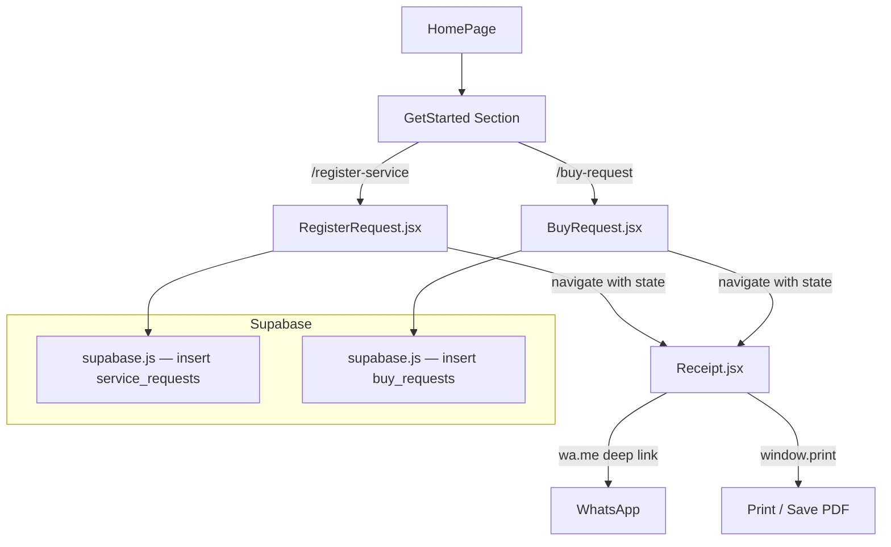

# Design Document: Complete Request System (Service + Buy)

## Overview

The Complete Request System adds two new request flows to the ServiceIS website: a **Service Request** (device repair/IT support) and a **Buy Request** (product purchase enquiry). Both flows share a unified receipt page and a common reference number generator. The system is entirely client-side — data is persisted to Supabase, WhatsApp notification is triggered via a `wa.me` deep link, and PDF download uses `window.print()` with print CSS. No server-side runtime is required beyond Supabase's hosted backend.

A new **GetStarted** section is inserted on the homepage between HeroSection and WhatWeDo, giving visitors two clear entry points. The existing `/register-repair` route and `RepairRegistration.jsx` are superseded but left in place.

### Design Goals

- Zero new runtime dependencies beyond `@supabase/supabase-js`
- Consistent dark-navy design system (`#0A0F1E`) with teal accent for service, gold accent for buy
- Single Receipt page handles both request types via route state
- Reference numbers are generated client-side before Supabase insert, so the receipt is shown immediately

---

## Architecture



### Key Architectural Decisions

1. **Client-side reference generation** — The reference is generated in the browser before the Supabase insert. This means the receipt can be shown immediately without waiting for a server round-trip to return a reference number.
2. **Route state for receipt** — Both form pages navigate to `/receipt` with `{ state: { type, reference, data } }`. The Receipt page reads `useLocation().state` and renders accordingly. No extra DB read is needed on the receipt page.
3. **Supabase singleton** — `src/lib/supabase.js` exports a single `createClient` instance, shared across all pages.
4. **No Twilio / no external PDF library** — WhatsApp uses `window.open('https://wa.me/...')` and PDF uses `window.print()` with a `@media print` stylesheet.

---

## Components and Interfaces

### New Files

| File | Purpose |
|---|---|
| `src/lib/supabase.js` | Supabase client singleton |
| `src/utils/generateReference.js` | Client-side reference generator |
| `src/components/GetStarted.jsx` | Homepage section with two CTA cards |
| `src/pages/RegisterRequest.jsx` | Multi-step service request form |
| `src/pages/BuyRequest.jsx` | Single-page buy request form |
| `src/pages/Receipt.jsx` | Unified receipt for both types |
| `src/pages/TrackRequest.jsx` | Phase 2 scaffold (stub) |

### Modified Files

| File | Change |
|---|---|
| `src/App.jsx` | Add routes: `/register-service`, `/buy-request`, `/receipt`, `/track-request` |
| `src/components/HeroSection.jsx` | Update primary CTA `href` to `#get-started` |
| `src/components/ContactSection.jsx` | Update "Enquire Now" button to scroll to `#get-started` |
| `src/pages/HomePage.jsx` | Insert `<GetStarted />` after `<HeroSection />` |

### Component Interfaces

#### `GetStarted`
```jsx
// No props — self-contained section
// Renders two cards: "Register a Service Request" and "Buy a Product"
// Each card links to the respective route
```

#### `RegisterRequest`
```jsx
// Multi-step form (3 steps):
//   Step 1: Device / service info (react-hook-form + yup)
//   Step 2: Contact details
//   Step 3: Review & submit
// On submit: generateReference('SRV') → insert to Supabase → navigate('/receipt', { state })
```

#### `BuyRequest`
```jsx
// Single-page form (react-hook-form + yup)
// Fields: product interest, budget range, contact details, notes
// On submit: generateReference('BUY') → insert to Supabase → navigate('/receipt', { state })
```

#### `Receipt`
```jsx
// Props via useLocation().state:
//   type: 'service' | 'buy'
//   reference: string
//   data: object (form submission data)
// Actions: WhatsApp deep link, window.print()
```

#### `generateReference(type)`
```js
// type: 'SRV' | 'BUY'
// Returns: 'SIS-SRV-YYYY-XXXXX' or 'SIS-BUY-YYYY-XXXXX'
// XXXXX = zero-padded random 5-digit number
```

---

## Data Models

### Supabase Table: `service_requests`

| Column | Type | Notes |
|---|---|---|
| `id` | `uuid` | Primary key, default `gen_random_uuid()` |
| `reference` | `text` | Unique, e.g. `SIS-SRV-2025-00042` |
| `device_type` | `text` | e.g. "Laptop", "Phone" |
| `manufacturer` | `text` | |
| `fault_description` | `text` | |
| `full_name` | `text` | |
| `email` | `text` | |
| `phone` | `text` | |
| `address` | `text` | |
| `created_at` | `timestamptz` | Default `now()` |

### Supabase Table: `buy_requests`

| Column | Type | Notes |
|---|---|---|
| `id` | `uuid` | Primary key, default `gen_random_uuid()` |
| `reference` | `text` | Unique, e.g. `SIS-BUY-2025-00017` |
| `product_interest` | `text` | What the customer wants to buy |
| `budget_range` | `text` | e.g. "₦100k–₦200k" |
| `full_name` | `text` | |
| `email` | `text` | |
| `phone` | `text` | |
| `notes` | `text` | Optional |
| `created_at` | `timestamptz` | Default `now()` |

### Reference Number Format

```
SIS-SRV-YYYY-XXXXX   (service requests)
SIS-BUY-YYYY-XXXXX   (buy requests)

Where:
  YYYY  = current 4-digit year
  XXXXX = zero-padded random integer 00001–99999
```

### Route State Shape (passed to Receipt)

```js
{
  type: 'service' | 'buy',
  reference: 'SIS-SRV-2025-00042',
  data: {
    full_name: string,
    email: string,
    phone: string,
    // ...other form fields
  }
}
```

---

## Correctness Properties

*A property is a characteristic or behavior that should hold true across all valid executions of a system — essentially, a formal statement about what the system should do. Properties serve as the bridge between human-readable specifications and machine-verifiable correctness guarantees.*

### Property 1: Reference format invariant

*For any* valid request type (`'SRV'` or `'BUY'`), calling `generateReference(type)` must return a string that exactly matches the pattern `SIS-{TYPE}-{YYYY}-{XXXXX}` where `{YYYY}` is the current 4-digit year and `{XXXXX}` is a zero-padded 5-digit integer between `00001` and `99999`.

**Validates: Requirements — reference format specification (both service and buy)**

### Property 2: Reference uniqueness

*For any* batch of 1000 generated references of the same type, no two references in the batch should be identical.

**Validates: Requirements — reference uniqueness**

### Property 3: Form schemas reject whitespace-only required fields

*For any* string composed entirely of whitespace characters (spaces, tabs, newlines), validating it against the required field rule in either the service request schema or the buy request schema must return invalid, leaving the form state unchanged and the Supabase insert uncalled.

**Validates: Requirements — form validation (service and buy)**

### Property 4: Supabase insert round-trip

*For any* valid form submission of either type, the data passed to the Supabase insert must contain the same reference string that was generated client-side and the same field values that were entered in the form.

**Validates: Requirements — data persistence for service and buy requests**

### Property 5: Receipt reflects route state

*For any* valid route state object `{ type, reference, data }` passed to the Receipt page, the rendered output must display the reference string, the full name from `data`, and a label corresponding to the request type.

**Validates: Requirements — receipt display**

### Property 6: WhatsApp URL contains reference

*For any* reference string passed to the WhatsApp URL builder, the resulting `wa.me` URL must contain that reference string (URL-encoded) in the message query parameter.

**Validates: Requirements — WhatsApp notification**

---

## Error Handling

| Scenario | Handling |
|---|---|
| Supabase insert fails (network error) | Show inline error banner on form; do not navigate to receipt; allow retry |
| Supabase insert fails (constraint violation, e.g. duplicate reference) | Regenerate reference and retry once; if second attempt fails, show error |
| Receipt page loaded with no route state (direct URL access) | Redirect to `/` with a toast or silent redirect |
| Form validation error | react-hook-form + yup surface field-level errors inline; submit button disabled until valid |
| WhatsApp deep link blocked (desktop) | Link opens in new tab; if browser blocks popup, user sees the URL to copy |
| `window.print()` unavailable | Button is hidden via feature detection; fallback text instructs user to use browser print |

---

## Testing Strategy

### Unit Tests

Focus on specific examples and edge cases:

- `generateReference('SRV')` returns a string matching `SIS-SRV-YYYY-XXXXX`
- `generateReference('BUY')` returns a string matching `SIS-BUY-YYYY-XXXXX`
- Receipt page redirects to `/` when `location.state` is null
- WhatsApp URL builder includes the reference in the message param
- Form schema rejects empty strings and whitespace-only strings for required fields

### Property-Based Tests

Using **fast-check** (JavaScript PBT library), minimum 100 iterations per property:

```js
// Feature: complete-request-system, Property 1: Reference format invariant
fc.assert(fc.property(fc.constantFrom('SRV', 'BUY'), (type) => {
  const ref = generateReference(type);
  const pattern = new RegExp(`^SIS-${type}-\\d{4}-\\d{5}$`);
  return pattern.test(ref);
}), { numRuns: 100 });

// Feature: complete-request-system, Property 2: Reference uniqueness
// Generate 1000 references of each type and assert Set size equals 1000

// Feature: complete-request-system, Property 3: Form schemas reject whitespace-only required fields
fc.assert(fc.property(fc.stringOf(fc.constantFrom(' ', '\t', '\n')), async (ws) => {
  const result = await serviceSchema.isValid({ full_name: ws, /* other fields valid */ });
  return result === false;
}), { numRuns: 100 });

// Feature: complete-request-system, Property 4: Supabase insert round-trip
// For any valid form data, mock Supabase and assert insert was called with matching reference + fields

// Feature: complete-request-system, Property 5: Receipt reflects route state
fc.assert(fc.property(validRouteStateArbitrary, (state) => {
  const { getByText } = render(<Receipt />, { wrapper: withRouterState(state) });
  return !!getByText(state.reference) && !!getByText(state.data.full_name);
}), { numRuns: 100 });

// Feature: complete-request-system, Property 6: WhatsApp URL contains reference
fc.assert(fc.property(fc.string({ minLength: 1 }), (ref) => {
  const url = buildWhatsAppUrl(ref);
  return url.includes(encodeURIComponent(ref));
}), { numRuns: 100 });
```

Each property-based test must be tagged with:
`Feature: complete-request-system, Property {N}: {property_text}`

Both unit and property tests are complementary — unit tests catch concrete bugs in specific scenarios, property tests verify general correctness across the input space.
