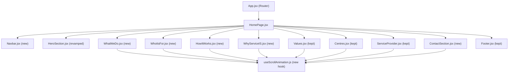

# Design Document: ServiceIS Website Revamp

## Overview

The ServiceIS website revamp transforms the existing React + Vite + Tailwind CSS single-page application into a premium, high-trust digital presence. The current site has a basic layout (HeroSection → ServiceProvider → Values → Centres → Contacts → Footer). The revamp reorganises this into eleven sections with five new components, one revamped component, and a global scroll-animation system — all without introducing new dependencies.

The design direction is a luxury IT concierge aesthetic: deep navy (`#0A0F1E`) for dark sections, clean white/light-grey for light sections, scroll-triggered fade/slide animations via the native `IntersectionObserver` API, and full mobile-first responsiveness.

---

## Architecture

The application remains a single-page React app routed through `react-router-dom`. All changes are confined to `src/components/` and `src/pages/HomePage.jsx`. No new npm packages are added.



### Key Architectural Decisions

- **No animation library**: `IntersectionObserver` is used directly via a custom hook (`useScrollAnimation`), keeping the bundle lean.
- **No new font**: The existing font stack configured in the project is used throughout.
- **Tailwind extended, not overwritten**: The `tailwind.config.js` is extended with the `#0A0F1E` navy colour token and the `animate-in`/`animate-out` keyframe utilities. Existing entries are preserved.
- **`Contacts.jsx` replaced**: `ContactSection.jsx` is a new file. `Contacts.jsx` is removed from `HomePage.jsx` but the file itself is left on disk to avoid breaking any potential future references.
- **Form submission**: `ContactSection` uses a plain HTML `<form>` with `action` and `method` attributes pointing to `formsubmit.co`, requiring no client-side fetch logic.

---

## Components and Interfaces

### `useScrollAnimation` hook — `src/hooks/useScrollAnimation.js`

```js
// Returns a ref to attach to a container element.
// When the element enters the viewport, 'animate-in' is added.
// When it exits, 'animate-out' is added.
useScrollAnimation(threshold?: number): React.RefObject<HTMLElement>
```

Internally creates one `IntersectionObserver` per hook call with `{ threshold: 0.15 }` by default. On intersection, toggles `animate-in` / `animate-out` on the ref's `children` (for staggered card grids) or on the element itself (for single containers). Stagger delay is applied as an inline `style.transitionDelay` of `index * 100ms`.

---

### `Navbar.jsx` — `src/components/Navbar.jsx`

Props: none  
State: `menuOpen: boolean`

- Renders `<nav>` with `position: fixed`, `top: 0`, `z-index: 50`, full width, navy background.
- Logo block: "ServiceIS" (bold, white) + tagline (small, grey).
- Desktop links: `<a href="#services">`, `<a href="#who-its-for">`, `<a href="#how-it-works">`, `<a href="#contact">` — all use CSS `scroll-behavior: smooth` (set globally on `html`).
- Mobile: hamburger icon (`FaBars` / `FaTimes` from `react-icons/fa`) toggles `menuOpen`. Dropdown renders below the bar as an absolutely positioned block.
- Box shadow applied via Tailwind `shadow-md` always (requirement says "while scrolling past top" — implemented as always-on shadow since the navbar is always fixed and the page always has content below).

---

### `HeroSection.jsx` — `src/components/HeroSection.jsx` (revamped)

Props: none  
State: none (static)

- Full-viewport `<section>` with `min-height: 100vh`.
- Background: `` from `https://source.unsplash.com/1600x900/?phone+repair+technician` as `object-cover`, with an absolutely positioned `<div>` overlay at `bg-[#0A0F1E]/70`.
- Desktop: CSS Grid `grid-cols-2`, left column text, right column 2×2 card grid.
- Mobile: single column, text first then cards.
- Left content: badge pill, `<h1>` heading, two `<p>` paragraphs, primary `<button>` (navy fill), secondary `<button>` (outline).
- Right content: 4 semi-transparent cards (`bg-white/10 backdrop-blur`) with label, title, body for: For Homes, For Individuals, For Families, For Executives.
- Entry animation: left column gets `animate-in` with `translateX(-40px)` variant; right cards stagger in from `translateX(40px)`. Applied via `useEffect` on mount (not scroll-triggered, since the hero is always visible on load).

---

### `WhatWeDo.jsx` — `src/components/WhatWeDo.jsx`

Props: none  
State: none

- `<section id="services">` with light background (`bg-gray-50`).
- Section label, heading, subtext.
- 6 service cards in `grid-cols-1 sm:grid-cols-2 lg:grid-cols-3`.
- Each card: icon (from `react-icons`), title, description. On hover: `hover:shadow-xl hover:border-blue-500 hover:-translate-y-1 transition-all`.
- Scroll animation: `useScrollAnimation` ref on the grid container; children stagger in/out.

Service cards data:

| # | Title | Icon |
|---|-------|------|
| 1 | Initial Digital Review | `FaSearch` |
| 2 | Home IT Setup & Optimization | `FaHome` |
| 3 | Personal Device & Account Management | `FaMobileAlt` |
| 4 | Family Digital Safety Support | `FaShieldAlt` |
| 5 | Ongoing IT Concierge | `FaHeadset` |
| 6 | Digital Audit Reports | `FaFileAlt` |

---

### `WhoItsFor.jsx` — `src/components/WhoItsFor.jsx`

Props: none  
State: none

- `<section id="who-its-for">` with white background.
- Desktop: `grid-cols-2` — left heading block, right `grid-cols-2` audience card grid.
- Mobile: single column.
- 6 audience cards. On hover: `hover:border-blue-200 hover:bg-blue-50 transition-all`.
- Scroll animation: stagger-fade via `useScrollAnimation`.

Audience cards: Executives and founders, Families and households, Expats and returning residents, High-performing professionals, Individuals managing multiple devices and subscriptions, Clients who prefer discreet high-touch service.

---

### `HowItWorks.jsx` — `src/components/HowItWorks.jsx`

Props: none  
State: none

- `<section id="how-it-works">` with `bg-[#0A0F1E]` (dark navy), white text.
- Section label, heading.
- 3 step cards side by side on desktop (`grid-cols-3`), stacked on mobile.
- Each card: large number ("01", "02", "03"), title, description.
- Scroll animation: slide up with staggered delay via `useScrollAnimation`.

Steps: 01 Review, 02 Plan, 03 Support.

---

### `WhyServiceIS.jsx` — `src/components/WhyServiceIS.jsx`

Props: none  
State: none

- `<section>` with light background.
- Single centred rounded card (`max-w-3xl mx-auto rounded-2xl shadow-lg p-12`).
- Section label, heading, body paragraph.
- Scroll animation: fade-in + scale-up (`scale-95` → `scale-100`) via `useScrollAnimation`.

---

### `ContactSection.jsx` — `src/components/ContactSection.jsx`

Props: none  
State: none (uncontrolled form)

- `<section id="contact">` with `bg-[#0A0F1E]`, white text.
- Desktop: `grid-cols-2` — left info column, right form column.
- Mobile: single column.
- Left: label, heading, body, contact details (email, phone, availability).
- Right: `<form action="https://formsubmit.co/ictweare.support@ictweare.com" method="POST">` with fields: Full Name, Email Address, Phone/WhatsApp, Message (textarea), newsletter checkbox, submit button.
- Input styling: `bg-white/10 border border-white/20 rounded-lg focus:ring-2 focus:ring-blue-400 text-white placeholder-white/50`.
- Scroll animation: left column fades from left, form slides from right via `useScrollAnimation`.

---

### `HomePage.jsx` — `src/pages/HomePage.jsx` (updated)

Renders sections in this exact order:

```jsx
<Navbar />
<HeroSection />
<WhatWeDo />
<WhoItsFor />
<HowItWorks />
<WhyServiceIS />
<Values />
<Centres />
<ServiceProvider />
<ContactSection />
<Footer />
```

---

## Data Models

This is a static marketing site — there are no persistent data models or API state. The only "data" is:

- **Static content arrays** defined inline in each component (service cards, audience cards, step cards, values).
- **Form submission**: uncontrolled HTML form POSTed to `formsubmit.co`. No client-side state management needed.
- **Animation state**: managed entirely via CSS class toggling on DOM nodes by `IntersectionObserver`. No React state involved.

### Tailwind Config Extension

```js
// tailwind.config.js — extended (not overwritten)
theme: {
  extend: {
    colors: {
      navy: '#0A0F1E',
    },
    keyframes: {
      fadeSlideIn: {
        '0%': { opacity: '0', transform: 'translateY(20px)' },
        '100%': { opacity: '1', transform: 'translateY(0)' },
      },
      fadeSlideOut: {
        '0%': { opacity: '1', transform: 'translateY(0)' },
        '100%': { opacity: '0', transform: 'translateY(20px)' },
      },
    },
  },
}
```

### Global CSS additions (`src/index.css`)

```css
html {
  scroll-behavior: smooth;
}

.animate-in {
  opacity: 1;
  transform: translateY(0);
  transition: opacity 500ms ease-in-out, transform 500ms ease-in-out;
}

.animate-out {
  opacity: 0;
  transform: translateY(20px);
  transition: opacity 500ms ease-in-out, transform 500ms ease-in-out;
}

/* Initial state for observed elements */
.scroll-observe {
  opacity: 0;
  transform: translateY(20px);
}
```

---


## Correctness Properties

*A property is a characteristic or behavior that should hold true across all valid executions of a system — essentially, a formal statement about what the system should do. Properties serve as the bridge between human-readable specifications and machine-verifiable correctness guarantees.*

### Property 1: WhatWeDo always renders exactly 6 service cards

*For any* render of the `WhatWeDo` component, the number of service card elements in the DOM should be exactly 6.

**Validates: Requirements 4.3**

---

### Property 2: WhoItsFor always renders exactly 6 audience cards

*For any* render of the `WhoItsFor` component, the number of audience card elements in the DOM should be exactly 6.

**Validates: Requirements 5.4**

---

### Property 3: HowItWorks always renders exactly 3 step cards

*For any* render of the `HowItWorks` component, the number of step card elements in the DOM should be exactly 3.

**Validates: Requirements 6.4**

---

### Property 4: Scroll animation hook toggles classes correctly on intersection change

*For any* DOM element observed by `useScrollAnimation`, when the `IntersectionObserver` callback fires with `isIntersecting: true` the element should have the `animate-in` class and not `animate-out`; when it fires with `isIntersecting: false` the element should have the `animate-out` class and not `animate-in`.

**Validates: Requirements 10.2, 10.3**

---

### Property 5: Stagger delay is proportional to card index

*For any* animated card grid rendered by a component using `useScrollAnimation`, the `transitionDelay` style of the card at index `i` should equal `i * 100` milliseconds.

**Validates: Requirements 10.6**

---

### Property 6: Navbar hamburger menu toggles open and closed

*For any* initial state of the `Navbar` component, clicking the hamburger icon should toggle `menuOpen` from `false` to `true`, and clicking a mobile navigation link (or clicking the icon again) should toggle it back to `false`.

**Validates: Requirements 2.6, 2.7**

---

## Error Handling

Since this is a static marketing site with no client-side data fetching or complex async logic, error handling is minimal but deliberate:

### Hero background image failure
- The Unsplash URL (`https://source.unsplash.com/...`) is an external resource. If it fails to load, the `` element will show nothing, but the dark navy overlay `div` will still render, keeping text readable. No explicit `onError` handler is required — the overlay acts as a graceful fallback.

### Form submission errors
- The contact form submits to `formsubmit.co` via a standard HTML POST. Network errors or service unavailability are handled by the browser's native form submission behaviour. No client-side error state is needed.
- `formsubmit.co` redirects to a thank-you page on success. A hidden `<input type="hidden" name="_next" value="...">` field can optionally be added to redirect back to the site.

### IntersectionObserver unavailability
- `IntersectionObserver` is supported in all modern browsers. For environments where it is unavailable (e.g., very old browsers or certain test environments), the `useScrollAnimation` hook should check `typeof IntersectionObserver !== 'undefined'` before instantiating, and fall back to leaving elements in their visible state (no animation).

### Missing section IDs
- Navigation links use `href="#section-id"`. If a section's `id` attribute is missing or misspelled, the browser will silently scroll to the top. This is caught by the example tests that verify each section's `id` attribute.

---

## Testing Strategy

### Dual Testing Approach

Both unit tests and property-based tests are required. They are complementary:
- **Unit/example tests** verify specific rendered output, DOM structure, attributes, and text content.
- **Property-based tests** verify universal invariants that should hold across all renders and all interaction sequences.

### Unit / Example Tests

Focus areas:
- Each new component renders without crashing.
- Section `id` attributes are correct (`services`, `who-its-for`, `how-it-works`, `contact`).
- Required text content is present (labels, headings, button text, contact details).
- Form `action` and `method` attributes are correct.
- Navbar links have correct `href` values.
- Dark sections have the `bg-[#0A0F1E]` class.
- `useScrollAnimation` creates an `IntersectionObserver` instance.
- CSS definitions for `animate-in` and `animate-out` contain the correct `opacity`, `transform`, and `transition` values.

Avoid writing unit tests for:
- CSS hover effects (covered by class presence checks).
- Responsive layout breakpoints (requires a real browser).
- Visual animation timing (covered by property tests on the hook).

### Property-Based Tests

Library: **fast-check** (already compatible with Vitest/Jest, no new runtime dependency — dev-only).

Each property test runs a minimum of **100 iterations**.

Tag format: `// Feature: serviceis-website-revamp, Property {N}: {property_text}`

| Property | Test Description | fast-check Approach |
|----------|-----------------|---------------------|
| P1: WhatWeDo card count | Render WhatWeDo, count cards | `fc.assert(fc.property(fc.constant(null), () => render(<WhatWeDo/>).getAllByRole('article').length === 6))` |
| P2: WhoItsFor card count | Render WhoItsFor, count cards | Same pattern, expect 6 |
| P3: HowItWorks card count | Render HowItWorks, count cards | Same pattern, expect 3 |
| P4: Hook class toggling | Mock IntersectionObserver with random `isIntersecting` boolean, assert correct class | `fc.boolean()` as the `isIntersecting` value |
| P5: Stagger delay | Generate random card index `i` (0–10), assert `transitionDelay === i * 100 + 'ms'` | `fc.integer({ min: 0, max: 10 })` |
| P6: Navbar toggle | Simulate random sequence of hamburger clicks and link clicks, assert final `menuOpen` state is consistent | `fc.array(fc.oneof(fc.constant('hamburger'), fc.constant('link')))` |

### Test File Locations

```
src/
  __tests__/
    Navbar.test.jsx
    HeroSection.test.jsx
    WhatWeDo.test.jsx
    WhoItsFor.test.jsx
    HowItWorks.test.jsx
    WhyServiceIS.test.jsx
    ContactSection.test.jsx
    useScrollAnimation.test.js
    HomePage.test.jsx
```

### Running Tests

```bash
# Single run (no watch mode)
npx vitest --run
```
